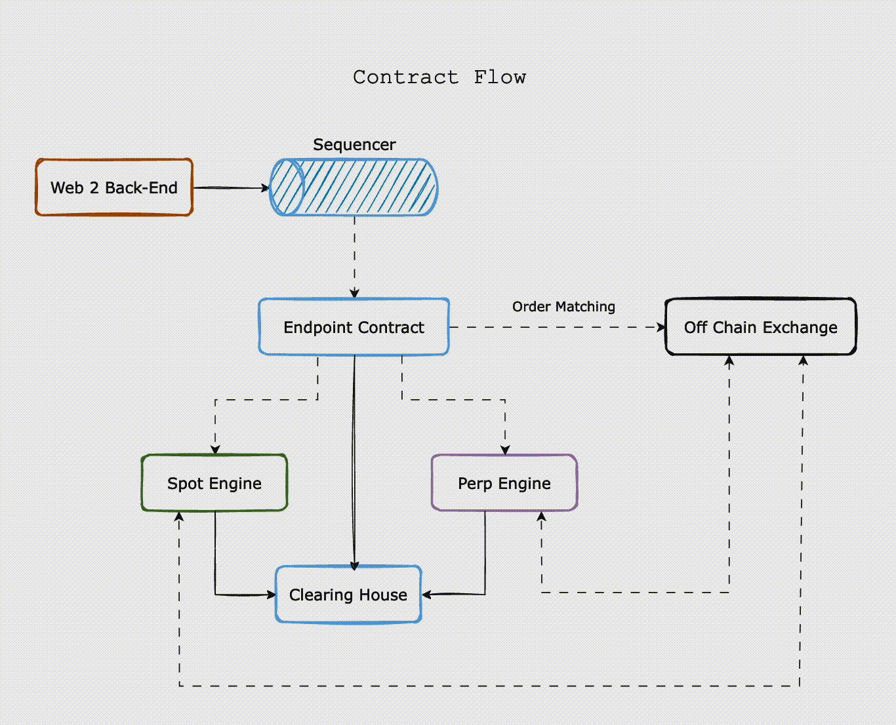

## **Overview**

The contract flow in the LogX Network involves multiple components, each playing a critical role in ensuring that trades and transactions are processed efficiently and securely. This section outlines the flow of requests, how orders are processed, and the interactions between different engines and contracts.

## **Key Components**

- **Sequencer**: Manages the order and timing of requests, ensuring controlled processing.
- **Endpoint Contract**: Central hub that interacts with different components based on the type of request.
- **Order Matching Engine**: Matches trade orders and forwards them to the **Off-Chain Exchange**.
- **Off-Chain Exchange**: Executes trades and updates user balances.
- **Spot Engine**: Manages spot balances and mappings.
- **Perp Engine**: Manages perpetual contract balances, including amounts, values, and funding rates.
- **Clearing House**: Handles fund transfers, staking, and balance updates.

### **1. User Request Initiation**

- All user requests are initiated through the Web 2 Back-End.
- These requests are then directed to the **Sequencer**.

### **2. Sequencer**

- The **Sequencer** is responsible for managing the order and timing of requests, ensuring that they are processed in a controlled manner.
- After sequencing, the requests are sent to the **Endpoint Contract**.

### **3. Endpoint Contract**

- The **Endpoint Contract** acts as the central hub for interacting with other components within the LogX Network.
- It receives requests from the sequencer and directs them based on the type of action required.

### **4. Order Processing**

- For order-related requests (such as trade orders), the **Endpoint Contract** forwards these requests to the **Order Matching Engine**.
- Once the order is matched, it is sent through the **Endpoint Contract** to the **Off-Chain Exchange**.

### **5. Off-Chain Exchange**

- The **Off-Chain Exchange** is where the actual trading happens. It handles the execution of matched orders and updates balances accordingly.
- It sends updates back to the **Perp Engine** and **Spot Engine**.

### **6. Spot Engine and Perp Engine**

- The **Spot Engine** and **Perp Engine** maintain mappings of user balances:
  - **Spot Engine**: Manages spot balances and user mappings.
  - **Perp Engine**: Manages perpetual balances, including the amount, quoted value, and the last funding rate for different perpetual contracts.
- These engines store the balances and ensure that they are accurately updated based on the trading activity in the **Off-Chain Exchange**.

### **7. Balance Updates**

- When an order or position is created or updated, the **Off-Chain Exchange** sends the updated balance information to the **Perp Engine** and **Spot Engine**.
- The engines then update the user’s spot and perpetual balances accordingly.

### **8. Clearing House Interaction**

- For functions such as claim, claim rewards, staking, unstaking, and withdrawing, the **Endpoint Contract** directly interacts with the **Clearing House**.
- The **Clearing House** acts like a fund house, handling the actual transfer and update of funds.
- It also updates the **Spot Engine** and **Perp Engine** with the latest balance information to reflect any changes.

<Info>
This is an overview of the detailed architecture. There are various intricate details not covered here that are essential to the full implementation.
</Info>