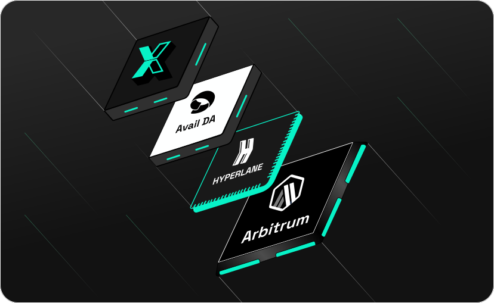

The LogX Network is designed to bridge the gap between centralized exchanges (CEXes) and decentralized exchanges (DEXes), offering the best of both worlds to traders. Our architecture is built to address the critical challenges of liquidity, security, and execution, ensuring that traders have a seamless and efficient trading experience without compromising on trust or control.

## **Introduction**

The most liquid markets today are centralized exchanges. These platforms offer traders deep liquidity, tight spreads, and low fees, which are essential for efficient trading. However, they also come with inherent risks, such as counterparty insolvency and the need to trust centralized entities. 

On the other hand, decentralized exchanges provide trustless, immutable trading environments where positions are secure and accessible without permission. Despite these advantages, DEXes often struggle with liquidity, leading to higher slippage and fees, which can deter traders.

LogX Network addresses these challenges by integrating the strengths of both CEX and DEX models, creating a hybrid architecture that offers:

- **Deep Liquidity**
- **Seamless Execution**
- **Tight Spreads**
- **Low Fees**
- **No Trust Assumptions**
- **Immutable Positions**
- **De-risked Counterparty Insolvency**
- **Permissionless Access**

**In this way, LogX Network solves for both liquidity and security with no compromise.**

## **Intent-Based Architecture and Order Flow**

At the core of LogX Network's architecture is our **Intent-Based Architecture and Order Flow**, which streamlines the trading process and enhances the user experience. This approach introduces a new kind of automatic market for quotations (AMFQ) method for perpetuals trading, which optimizes how orders are placed, matched, and executed.

### **How It Works**

1. **Trader Initiates a Trade:**
   - The trader arrives at LogX Network and selects the desired token market. They enter all necessary details for the trade, including the asset, volume, and any specific conditions they are looking for.
   
2. **Solver Provides an Offer:**
   - The solver (market maker) automatically generates an offer based on the conditions set by the trader. This offer includes key trade parameters such as price, slippage, fees, funding rates, and required collateral.
<Tip>   
    **Note:** At this stage, no capital is committed by the solver. The offer is simply a quote that the trader can review.
</Tip>
3. **Trader Reviews and Accepts the Quote:**
   - The trader receives the quote with all pre-agreed conditions. This step is streamlined compared to traditional RFQ processes, as the quote is provided in real time, allowing the trader to make an informed decision quickly.
   - If the trader is satisfied with the conditions, they can choose to execute the trade.

4. **On-Chain Trade Execution:**
   - Once the trader accepts the quote, the required collateral (initial margin) is locked into the contract. This collateral serves as the guarantee for the trade.
   
5. **Solver Accepts the Trade:**
   - The solver observes the request and, upon accepting it, deposits their required initial margin into the contract. This action formalizes the trade.
   
6. **Formation of a Bilateral Agreement:**
   - A bilateral agreement is established between the solver and the trader. This contract is isolated and symmetrical, ensuring that depending on the price movement of the position, one party is obligated to pay the other as profit or loss (PnL).
   - This agreement remains in effect until the trader closes the position or if either party is liquidated (managed automatically by a neutral third party based on the margin health).
<Info>   
   **Note:** Steps 4 - 6 take place **on-chain**, where the quotation and bilateral agreement are recorded and enforced.
</Info>

7. **Solver Hedging:**
   - The solver may choose to hedge their position exposure by leveraging various sources, including centralized exchanges (CEXes), other decentralized exchanges (DEXes), over-the-counter (OTC) desks, non-linear options, or spot holdings.
   - Additionally, the solver can net positions with other trades or collaborate with other solvers in the network to optimize their exposure.

<Note> 
  **Note:** Step 7 occurs **off-chain**, with the solver responsible for managing their own hedging strategy. Since collateral is locked into the **Bilateral Agreement** and completely isolated from external factors, users do not need to make any trust assumptions regarding the solvency of the solver on-chain.
</Note>
## **Key Benefits of LogX Architecture**

### **1. Combining CEX Liquidity with DEX Security**

LogX Network effectively combines the deep liquidity and seamless execution of CEXes with the trustless and secure nature of DEXes. Traders benefit from tight spreads, low fees, and fast execution without compromising on the security and transparency provided by on-chain settlements.

### **2. Streamlined Trading Process**

The Intent-Based Architecture simplifies the traditional RFQ process by allowing solvers to automatically generate and stream quotes in real time. This ensures that traders always have access to the best possible price, reducing the time and complexity involved in executing trades.

### **3. Flexible Hedging Strategies for Solvers**

Solvers have the flexibility to manage their risk through various hedging strategies, leveraging both centralized and decentralized markets. This flexibility ensures that solvers can provide competitive quotes while managing their exposure effectively.

### **4. Secure Bilateral Agreements**

All trades on LogX Network are backed by on-chain bilateral agreements, which are immutable and enforceable. This ensures that both parties have a clear understanding of their obligations and that trades are settled transparently.

### **5. Permissionless Access and No Trust Assumptions**

LogX Network maintains the permissionless nature of DEXes, allowing anyone to participate in the market without needing approval from a centralized authority. Additionally, since the collateral is locked in smart contracts, traders do not need to trust the solvency of their counterparties.

